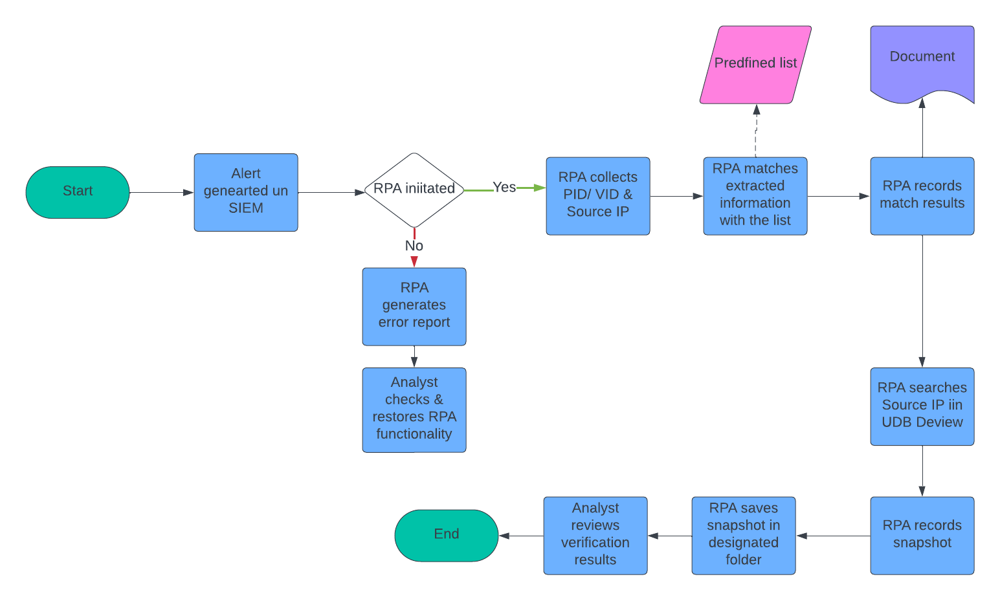

# MSCS-Project25356
MSCS Project

### Project Summary

In the realm of cybersecurity operations, the timeliness and efficiency of incident response are
critical to mitigating potential threats and minimizing damage. The rapid identification, analysis,
and resolution of security incidents can significantly reduce the impact of cyber-attacks. This
necessitates a structured approach where time-based actions are prioritized to ensure prompt
responses. Robotic Process Automation (RPA) emerges as a powerful tool in enhancing these
operations. By automating repetitive and time-consuming tasks, RPA enables security teams to
focus on more strategic decision-making processes. The integration of RPA into cybersecurity
workflows can lead to faster log analysis, streamlined data extraction, and efficient handling of
alerts. This report explores the importance of time-based actions in incident response and
demonstrates how RPA can assist in optimizing these processes. This report highlights using
UIPath to implement an automation process. This project underscores the potential of RPA to
transform cybersecurity operations, making them more resilient and responsive in the face of
evolving threats.

### Novelty
The novelty this project lies in integrating Robotic Process Automation (RPA) with Security and Event Management (SIEM) tools like Microsoft Sentinel to enhance cybersecurity operations. By automating repetitive and time-consuming tasks, the project improves the efficiency and accuracy of Security Operations Center (SOC) workflows, allowing analysts to focus on strategic tasks and reducing response times. It showcases a comprehensive approach to workflow automation, including log extraction, data processing, and evidence gathering, while emphasizing the importance of time-based actions in incident response. Utilizing advanced tools like Microsoft Sentinel and UIPath, the project offers a scalable and adaptable solution, demonstrating significant potential to transform and optimize incident response and overall security operations.

### Flow Chart

### Images
